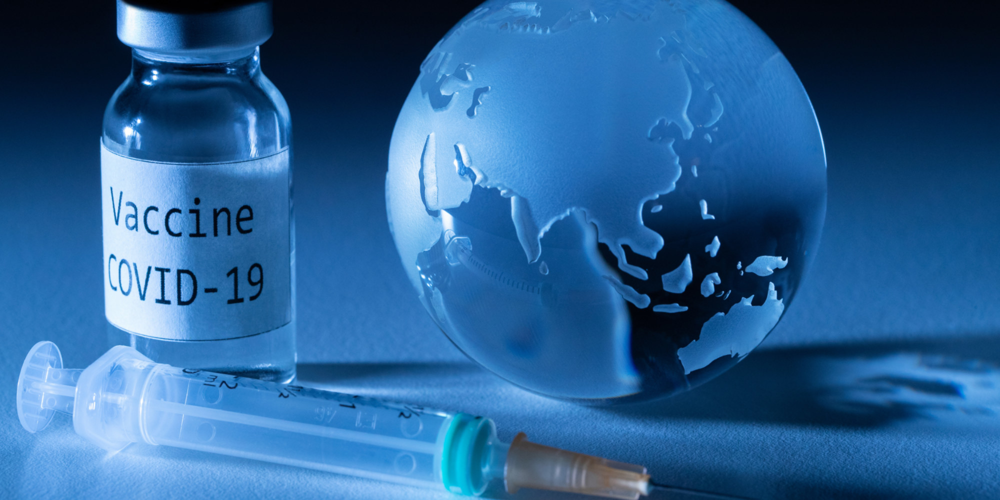

# Données de vaccination En France

Dès le lancement de la campagne de vaccination, les autorités 
sanitaires ont disposé d’informations permettant un suivi quotidien de 
l’avancée et du déploiement de la campagne sur le territoire. Dans ce travail, on présentera des données extraites du site de gouvernement décrivant l'évolution de la campagne de vaccination.

## Sommaire

1. Données vaccination par tranche d'âge, type de vaccin et département / région

2. Nombre de personne vaccinées en France par région

3. Evolution de la campagne de vaccination 

4. Stock des dose

5. Type de vaccins présent dans chaque région

6. Nombre lieu de vaccination France
 

## 1. Données vaccination par tranche d'âge, type de vaccin et département / région

Les données suivants présentent des informations relatives à la vaccination contre la Covid-19 par tranche d’âge, type de vaccin, département et région de résidence des patients.

Pour chaque tranche d’âge, type de vaccin, département et région, sont présentés :

- les effectifs de patients :

ayant reçu au moins une première injection ;
dont le schéma vaccinal initial est terminé ;
ayant reçu une injection de rappel (non calculés par type de vaccin) ;
ayant reçu une injection de rappel et étant éligibles au rappel (non calculés par type de vaccin) ;
- les taux de patients :

ayant reçu au moins une première injection ;
dont le schéma vaccinal initial est terminé ;
ayant reçu une injection de rappel, rapportés à la population Insee (non calculés par type de vaccin) ;
ayant reçu une injection de rappel, rapportés à la population éligible (non calculés par type de vaccin).
<iframe src="https://data.opendatasoft.com/explore/embed/dataset/donnees-vaccination-par-tranche-dage-type-de-vaccin-et-departement@cnam/table/?&static=false&datasetcard=false" width="900" height="1000" frameborder="0"></iframe>

## 2. Nombre de personne vaccinées en France par région
<iframe src="https://data.opendatasoft.com/chart/embed/?dataChart=eyJ0aW1lc2NhbGUiOiIiLCJxdWVyaWVzIjpbeyJjaGFydHMiOlt7InR5cGUiOiJsaW5lIiwiZnVuYyI6IkFWRyIsInlBeGlzIjoibl9yYXBwZWwiLCJzY2llbnRpZmljRGlzcGxheSI6dHJ1ZSwiY29sb3IiOiIjRkY1MTVBIn1dLCJ4QXhpcyI6InJlZ19uYW1lIiwibWF4cG9pbnRzIjoiIiwidGltZXNjYWxlIjoiIiwic29ydCI6IiIsImNvbmZpZyI6eyJkYXRhc2V0IjoiY292aWQtMTktZnJhbmNlLXZhY2NpbmF0aW9ucy1hZ2Utc2V4ZS1kZXBAcHVibGljIiwib3B0aW9ucyI6e319fV0sImFsaWduTW9udGgiOnRydWUsImRpc3BsYXlMZWdlbmQiOnRydWV9&static=false&datasetcard=false" width="800" height="600" frameborder="0"></iframe>

## 3. Evolution de la campagne de vaccination 

<iframe src="https://data.opendatasoft.com/explore/embed/dataset/covid-19-france-vaccinations-age-sexe-dep@public/custom/?disjunctive.variable_label&sort=date&dataChart=eyJxdWVyaWVzIjpbeyJjaGFydHMiOlt7InR5cGUiOiJsaW5lIiwiZnVuYyI6IkFWRyIsInlBeGlzIjoibl9kb3NlMSIsInNjaWVudGlmaWNEaXNwbGF5Ijp0cnVlLCJjb2xvciI6IiNGRjUxNUEifV0sInhBeGlzIjoiZGF0ZSIsIm1heHBvaW50cyI6IiIsInRpbWVzY2FsZSI6InllYXIiLCJzb3J0IjoiIiwiY29uZmlnIjp7ImRhdGFzZXQiOiJjb3ZpZC0xOS1mcmFuY2UtdmFjY2luYXRpb25zLWFnZS1zZXhlLWRlcEBwdWJsaWMiLCJvcHRpb25zIjp7ImRpc2p1bmN0aXZlLnZhcmlhYmxlX2xhYmVsIjp0cnVlLCJzb3J0IjoiZGF0ZSJ9fX1dLCJkaXNwbGF5TGVnZW5kIjp0cnVlLCJhbGlnbk1vbnRoIjp0cnVlLCJ0aW1lc2NhbGUiOiIifQ%3D%3D&static=false&datasetcard=false" width="1000" height="800" frameborder="0"></iframe>

Les graphes ci-dessus représentent l'évolution de la campagne de vaccination depuis son début en début de l'année 2021 jusqu'à maintenant. Les graphes représentent cette évolution selon les tranches d'âges et en fontion de sexe aussi.

## 4. Stock des doses

Le graphe suivant représente la somme de nombre de dose depuis le début de la campagne de la vaccination.

<iframe src="https://data.centrevaldeloire.fr/explore/embed/dataset/stocks-des-doses-de-vaccins-contre-la-covid-19/analyze/?dataChart=eyJxdWVyaWVzIjpbeyJjaGFydHMiOlt7InR5cGUiOiJsaW5lIiwiZnVuYyI6IlNVTSIsInlBeGlzIjoiZG9zZV9udW1iZXIiLCJzY2llbnRpZmljRGlzcGxheSI6dHJ1ZSwiY29sb3IiOiIjMEFCRkJGIn1dLCJ4QXhpcyI6ImRhdGUiLCJtYXhwb2ludHMiOiIiLCJ0aW1lc2NhbGUiOiJkYXkiLCJzb3J0IjoiIiwiY29uZmlnIjp7ImRhdGFzZXQiOiJzdG9ja3MtZGVzLWRvc2VzLWRlLXZhY2NpbnMtY29udHJlLWxhLWNvdmlkLTE5Iiwib3B0aW9ucyI6e319fV0sImRpc3BsYXlMZWdlbmQiOnRydWUsImFsaWduTW9udGgiOnRydWV9&static=false&datasetcard=false" width="900" height="400" frameborder="0"></iframe>

## 5. Type de vaccins présent dans chaque région

Le graphe suivant est un graphe réalisé à l'aide de l'outils RawGraphe. Il permet de visualiser pour chaque région le type de vaccin dont elle dispose.

## 6. Nombre lieu de vaccination France

Le graphe suivant représente le nombre de centre de vaccination dont dispose chaque région en France.

<iframe src="https://data.opendatasoft.com/explore/embed/dataset/covid19-france-lieu-vaccination@public/analyze/?disjunctive.centre_type&disjunctive.reg_code&disjunctive.reg_name&disjunctive.dep_code&disjunctive.dep_name&disjunctive.epci_code&disjunctive.epci_name&disjunctive.com_arm_name&disjunctive.com_arm_area_code&location=2,18.50104,-3.64435&basemap=jawg.streets&dataChart=eyJxdWVyaWVzIjpbeyJjaGFydHMiOlt7InR5cGUiOiJjb2x1bW4iLCJmdW5jIjoiQ09VTlQiLCJ5QXhpcyI6ImdpZCIsInNjaWVudGlmaWNEaXNwbGF5Ijp0cnVlLCJjb2xvciI6IiMxQjY2OTgifV0sInhBeGlzIjoicmVnX25hbWUiLCJtYXhwb2ludHMiOiIiLCJ0aW1lc2NhbGUiOiIiLCJzb3J0Ijoic2VyaWUxLTEiLCJjb25maWciOnsiZGF0YXNldCI6ImNvdmlkMTktZnJhbmNlLWxpZXUtdmFjY2luYXRpb25AcHVibGljIiwib3B0aW9ucyI6eyJkaXNqdW5jdGl2ZS5jZW50cmVfdHlwZSI6dHJ1ZSwiZGlzanVuY3RpdmUucmVnX2NvZGUiOnRydWUsImRpc2p1bmN0aXZlLnJlZ19uYW1lIjp0cnVlLCJkaXNqdW5jdGl2ZS5kZXBfY29kZSI6dHJ1ZSwiZGlzanVuY3RpdmUuZGVwX25hbWUiOnRydWUsImRpc2p1bmN0aXZlLmVwY2lfY29kZSI6dHJ1ZSwiZGlzanVuY3RpdmUuZXBjaV9uYW1lIjp0cnVlLCJkaXNqdW5jdGl2ZS5jb21fYXJtX25hbWUiOnRydWUsImRpc2p1bmN0aXZlLmNvbV9hcm1fYXJlYV9jb2RlIjp0cnVlfX19XSwiZGlzcGxheUxlZ2VuZCI6dHJ1ZSwiYWxpZ25Nb250aCI6dHJ1ZSwidGltZXNjYWxlIjoiIn0%3D&static=false&datasetcard=false" width="800" height="600" frameborder="0"></iframe>

## Conclusion

Dans ce travail, on vous a présenté des données sous forme d'open data prise du site de gouvernement. Ces données sont variées et comportent d'importantes statistiques en tous ce qui concerne la campagne de vaccination depuis son début en début de l'année 2021 jusqu'à maintenant. Ces statistiques nous informent à la fois de l'évolution de la campagne de vaccination, la répartition des lieux de vaccination, la gestion de stock de vaccin, le nombre de personne vaccinées par chaque région selon tranche d'âge et en fonction sexe... Pour bien visualiser nos données, on s'est basé sur des représentations grahiques à l'aide de l'outils Opendatasoft et Rawgraph. 

